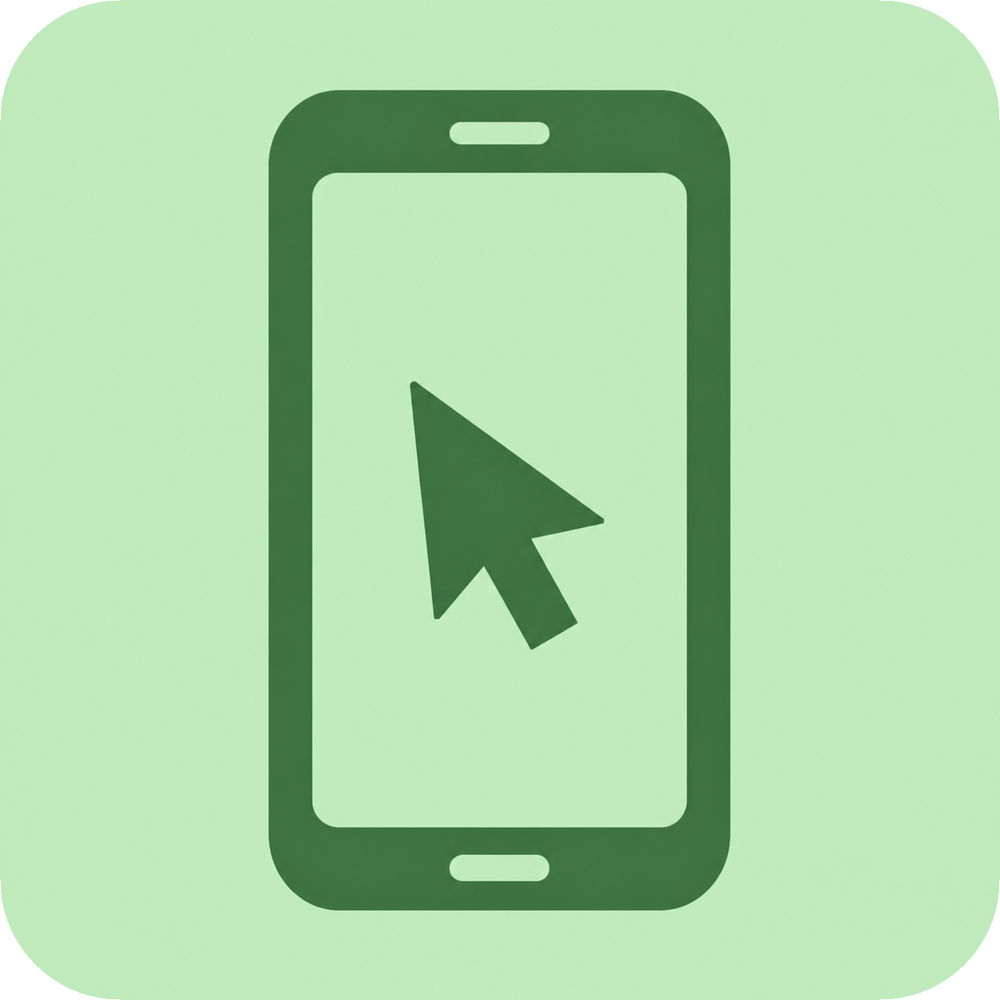
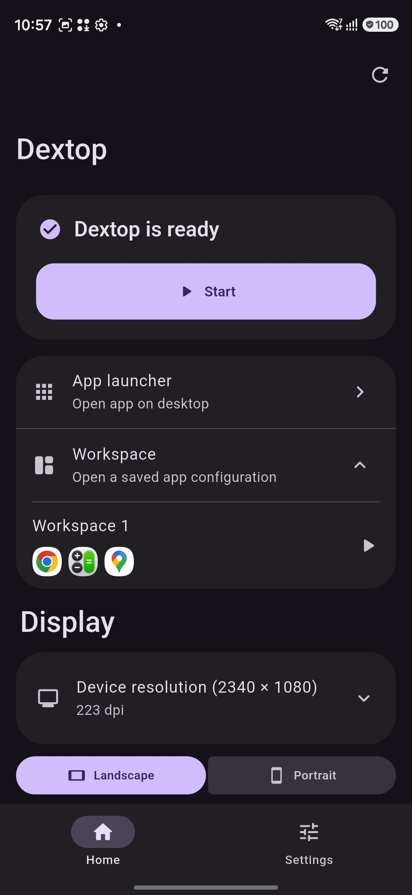
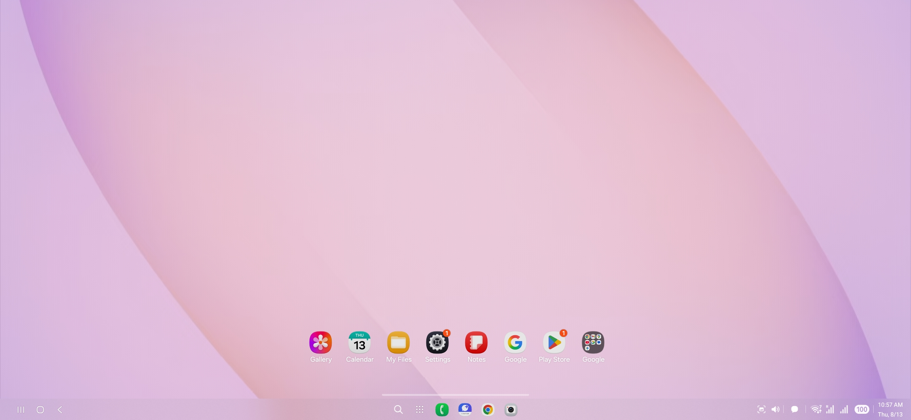
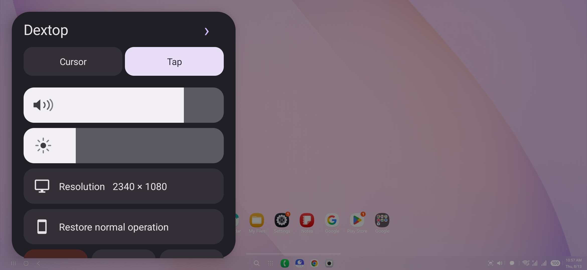

<p align="center">
  
</p>

<h1 align="center">Dextop</h1>

<p align="center">
  <a href="README.md">English</a> | <a href="README.ja.md">日本語</a> | <a href="README.zh-CN.md">简体中文</a> | <a href="README.ko.md">한국어</a>
</p>

Dextop 是一款开源 Android 应用，可在手机上创建虚拟显示器，并仅使用智能手机提供类似桌面的工作空间。Dextop 1.5.0 及更高版本内置特权访问运行时，并通过 Android 系统服务控制应用启动、窗口位置、触摸输入、屏幕方向及相关桌面行为。

## 社区与反馈

加入官方 Discord 服务器：[点击加入](https://discord.com/invite/444YG3srK)

您可以在这里报告错误、提交设备运行报告并提出功能请求。

## 截图与演示

<table>
  <tr>
    <td width="20%" align="center"><br><sub>主页与工作区</sub></td>
    <td width="20%" align="center"><br><sub>桌面</sub></td>
    <td width="20%" align="center"><br><sub>控制浮层</sub></td>
    <td width="20%" align="center"><br><sub>多窗口工作区</sub></td>
    <td width="20%" align="center"><a href="docs/media/dextop-demo.mp4"></a><br><sub>▶ 演示视频</sub></td>
  </tr>
</table>

## 功能

- [x] 可配置分辨率、DPI、横屏或竖屏方向的虚拟显示器
- [x] 安全显示和 Android 系统装饰控制
- [x] 桌面应用启动器
- [x] 保存并恢复多个应用位置的工作区
- [x] 双栏、三栏、四栏及其他窗口布局
- [x] 以 JSON 导入和导出工作区
- [x] 光标与直接触摸输入模式
- [x] 点击、长按、拖动、右键、双指及三指手势
- [x] 包括滚动和双指缩放在内的多点触控输入
- [x] 支持物理鼠标
- [x] 支持物理键盘
- [x] 在受支持设备上切换 Dextop 与外接显示器之间的鼠标和键盘输入路由
- [x] 支持保存显示器布局和跨显示器指针路由的多显示器拓扑
- [x] 自动隐藏桌面任务栏，并可让内置显示器保持 120 Hz
- [x] 折叠设备笔记本模式，包含美式键盘、触控板、手动浮层控制和可选的铰链角度自动检测
- [x] 可从“样式”菜单切换的虚拟游戏手柄，支持 ABXY、L/R、扳机键、摇杆、方向键以及 Start/Select/Home
- [ ] 折叠设备主屏／副屏切换（支持不完整；部分设备仍存在分辨率或屏幕切换问题）
- [x] 显示 FPS、刷新率、内存、电池和估算功耗的性能浮层
- [x] 从快速设置磁贴启动
- [x] 恢复中断的会话和临时 Android 设置
- [x] 包含应用日志、能力探测、回退结果和设备规格的详细诊断报告
- [x] 支持逐项结果和自动邮件编写的本地化设备运行报告
- [x] 日语、英语、中文、韩语和俄语界面

## 兼容性

| 环境 | 状态 | 备注 |
| --- | --- | --- |
| Samsung DeX（One UI 8 或更高版本） | 完全支持 | 目前功能最完整的环境。由 DeX 管理的功能使用 Samsung 平台实现。 |
| Samsung DeX（低于 One UI 8） | 支持有限且很可能不兼容 | 较旧的 DeX 实现可能无法提供 Dextop 所需的显示和窗口管理行为。 |
| Google Pixel | 有限且不完整 | 取决于 Android 的自由窗口／桌面实现和隐藏 API 可用性，部分功能可能无法工作。 |
| OPPO ColorOS 桌面 | 有限且不完整 | 可以显示桌面，但任务栏等系统界面组件可能不会出现。 |
| 运行 HyperOS 或更高版本的 Xiaomi 设备 | 已禁用 | MIUI 和 HyperOS 不受支持。 |
| 其他 Android 设备 | 实验性 | 虚拟显示、镜像和自由窗口支持因厂商、型号和系统更新而异。 |

Dextop 会在运行时探测设备能力，并依次尝试兼容的后端。但由于仍依赖 Android 隐藏 API 和 OEM 行为，即使是同一厂商的不同型号或系统版本，结果也可能不同。

<details>
<summary><strong>支持的设备</strong></summary>

以下状态仅适用于实际测试过的固件版本。展开厂商可查看设备。构建信息和逐项功能结果请参阅[设备兼容性 Wiki](https://github.com/NarYuki/Dextop/wiki/Device-Compatibility)。

<details>
<summary><strong>Samsung</strong></summary>

| 设备 | 型号 | 已测试软件 | 状态 |
| --- | --- | --- | --- |
| Galaxy S26 | SM-S942Z (`m1q`) | Android 16 / One UI 8.5 / `S942ZSCS1AZF2` | ✅ 已确认可用 |

</details>

<details>
<summary><strong>Google</strong></summary>

尚未确认任何具体型号与固件组合。Pixel 支持仍然有限且不完整。

</details>

<details>
<summary><strong>其他厂商</strong></summary>

尚未确认任何具体型号与固件组合。

</details>
</details>

## 运行要求

- Android 10 或更高版本。大多数设备需要 Android 14 或更高版本才能提供可用的桌面环境。
- Dextop 1.5.0 或更高版本（包括最新版本）

Dextop 1.5.0 及更高版本内置正常运行所需的访问功能，因此不要求安装外部应用或单独的特权服务。设置和首次使用都可以仅通过 Dextop 完成；根据设备情况，Android 仍可能显示系统权限或无线调试配对页面。

如果设备已 root，或已经在使用 Stellar、Shizuku 等兼容的特权服务，Dextop 仍然可以使用这些环境。Dextop 会自动检测可用环境并自动适配，无需迁移或替换现有配置。

## 安装

Google Play 版本目前正在审核中。

从 [GitHub Releases](https://github.com/NarYuki/Dextop/releases/latest) 下载最新 APK 并安装。

## 开发

```sh
git clone https://github.com/NarYuki/Dextop.git
cd Dextop
flutter pub get
flutter analyze
flutter test
flutter build apk --debug
```

如需贡献新设备支持，请阅读[添加设备支持](docs/ADDING_DEVICE_SUPPORT.zh-CN.md)。[英文版](docs/ADDING_DEVICE_SUPPORT.en.md)和[日文版](docs/ADDING_DEVICE_SUPPORT.md)也可供参考。

## 诊断

打开**设置 → 应用信息 → 运行日志与设备诊断**，即可查看、复制或分享设备规格、能力探测、回退结果和 Dextop 运行日志。在将报告附加到 Issue 前，请删除不希望公开的个人信息。

## 设备运行报告

打开**设置 → 设备运行报告**，即可报告Dextop在特定设备和固件上的运行情况。为总体结果和每项功能选择**运行正常**、**无法运行**或**未测试**，按需填写补充说明，然后点击**通过电子邮件发送报告**。Dextop会生成结构化Markdown正文，并以`dextop-device@n4t.su`为收件人打开邮件应用。

报告包含设备型号、代号、Android/API版本、固件标识、安全补丁、Dextop版本、自动检测能力以及所选结果。请在发送前检查邮件内容。详情请参阅[设备运行报告Wiki](https://github.com/NarYuki/Dextop/wiki/Device-Reports)。

本项目正在积极开发中。可用功能和行为可能随设备固件及 Android 更新而变化。

## 许可证

本项目采用 GPL-3.0-or-later 许可证。详情请参阅 [LICENSE](LICENSE)。
